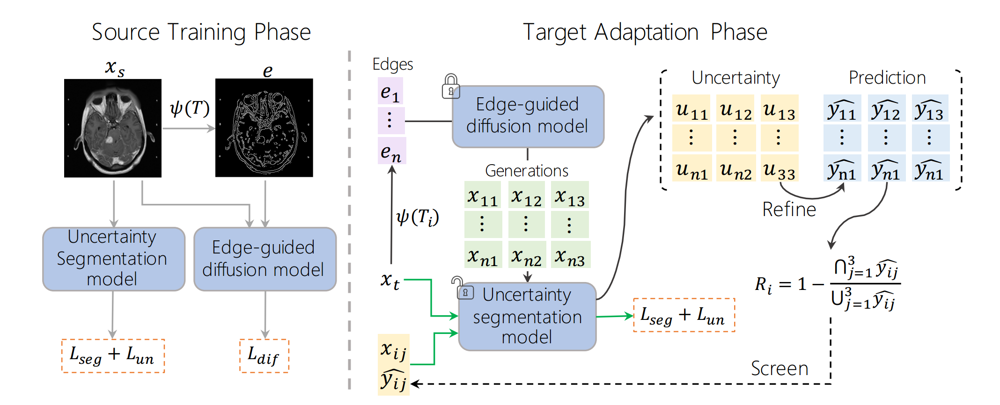

# Reliable source approxmation (RSA)
**Reliable Source Approximation: Source-Free Unsupervised Domain Adaptation for Vestibular Schwannoma MRI Segmentation**, Early accepted by MICCAI'2024 paper

Hongye Zeng, Ke Zou, Zhihao Chen, Rui Zheng, Huazhu Fu

\[[Open Access Version](https://papers.miccai.org/miccai-2024/paper/2349_paper.pdf)\] | \[[Cite](#citation)\]

**Abstract:** Source-Free Unsupervised Domain Adaptation (SFUDA) has recently become a focus in the medical image domain adaptation, as it only utilizes the source model and does not require annotated target data. However, current SFUDA approaches cannot tackle the complex segmentation task across different MRI sequences, such as the vestibular schwannoma segmentation. To address this problem, we proposed Reliable Source Approximation (RSA), which can generate source-like and structure-preserved images from the target domain for updating model parameters and adapting domain shifts. Specifically, RSA deploys a conditional diffusion model to generate multiple source-like images under the guidance of varying edges of one target image. An uncertainty estimation module is then introduced to predict and refine reliable pseudo labels of generated images, and the prediction consistency is developed to select the most reliable generations. Subsequently, all reliable generated images and their pseudo labels are utilized to update the model. Our RSA is validated on vestibular schwannoma segmentation across multi-modality MRI.  The experimental results demonstrate that RSA consistently improves domain adaptation performance over other state-of-the-art SFUDA methods.


## 1. Requirements
```
pip install -r requirements.txt
```

## 2. Data preparation
We used MR images included contrast-enhanced T1-weighted (ceT1) images and high-resolution T2-weighted (hrT2) images. The original dataset can be found [here](https://www.cancerimagingarchive.net/collection/vestibular-schwannoma-seg/), and you can use the [official data preprocess code](https://github.com/KCL-BMEIS/VS_Seg).

Alternatively, you can directly use the [data we have  preprocessed and split](https://drive.google.com/file/d/1eV_23hgthHMx7TK3H-_Q54rvF-oEwl8_/view?usp=sharing). 

Download above data and organize the dataset directory structure as follows:
```
data/
    T1/
        training/
        testing/
        validation/
     T2/
        training/
        testing/
        validation/
```

## 3. Training on source dataset
Train diffusion model
```
python diffusion/ddpm/ddpm_train.py \
    --data_type VS \
    --save_dir $YOUR_DDPM_SAVE_PATH
python diffusion/controlnet/controlnet_train.py \
    --ddpm_ckpt $YOUR_CONTROLNET_SAVE_PATH
```

Train segmentation model
```
python segmentation/seg_train.py  \
    --data_dir data/VS/T1   \
    --save_dir $YOUR_SEG_MODEL_SAVE_PATH  \ 
    --seed $SEED
```

## 4. Reliable source approxmation
Step 1: Translate T2 images to T1 using edge
```
python rsa/1_translate.py
```

Step 2: Select reliable samples
```
python rsa/2_select.py  \
    --save_dir $YOUR_SELECTED_SAMPLE_SAVE_DIR \
    --seg_ckpt_dir $YOUR_CHECKPOINT_PATH  \
    --seed $SEED
```

Step 3: Finetune pretrained source segmentation model
```
python rsa/3_finetune.py \
    --sample_dir $YOUR_SELECTED_SAMPLE_SAVE_DIR\
    --save_dir $YOUR_CHECKPOINT_SAVE_PATH \
    --checkpoint $YOUR_SOURCE_SEGMENTATION_MODEL\
    --n_epoch 100
```

## 5. Translation demo
Comming soon ...

Translate T1 image using [our diffusion checkpoints]().


## Citation
```
@InProceedings{Zen_Reliable_MICCAI2024,
        author = { Zeng, Hongye and Zou, Ke and Chen, Zhihao and Zheng, Rui and Fu, Huazhu},
        title = { { Reliable Source Approximation: Source-Free Unsupervised Domain Adaptation for Vestibular Schwannoma MRI Segmentation } },
        booktitle = {proceedings of Medical Image Computing and Computer Assisted Intervention -- MICCAI 2024},
        year = {2024},
        publisher = {Springer Nature Switzerland},
        volume = {LNCS 15010},
        month = {October},
        page = {pending}
}
```